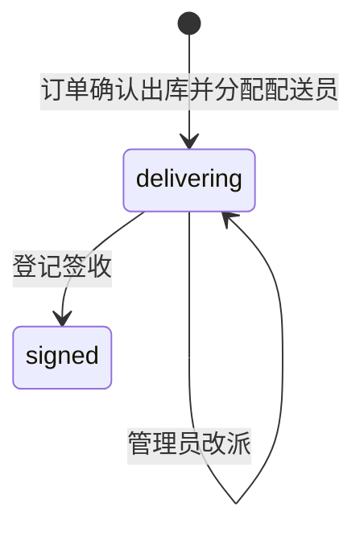

# 配送管理模块

## 概述

配送管理承接销售订单出库后的履约过程。每个订单最多对应一条 `order_deliveries` 记录，数据库通过 `order_id` 唯一约束保证一对一关系。确认出库时创建配送记录和首次分配事件；登记签收时同时把订单从 `stocked_out` 推进到 `delivered_unpaid`。

当前页面按配送员对多条订单配送记录进行查询聚合，仅用于展示和统计，不产生额外的履约实体。

“当前配送”首次加载时自动展开存在订单的配送员卡片，卡片可手动收起或再次展开，后续数据刷新保留用户当前的展开状态。展开后直接显示订单号、配送状态、客户与收货快照、商品件数、金额、出库时间和最近异常；点击“查看订单”进入 `/order/detail/{order_id}` 独立订单详情页。

## 数据模型

### 配送记录 `order_deliveries`

| 字段组 | 主要字段 | 说明 |
|---|---|---|
| 订单关联 | `order_id` | 唯一关联销售订单 |
| 当前配送员快照 | `delivery_employee_id`, `delivery_employee_name` | 当前负责员工及出库或改派时保存的姓名 |
| 配送状态 | `status` | `delivering`、`signed` |
| 收货快照 | `recipient_name`, `recipient_phone`, `delivery_address` | 确认出库时保存，不随客户资料后续变化 |
| 分配审计 | `assigned_at`, `assigned_by_id`, `assigned_by_name` | 首次分配时间和操作人 |
| 签收结果 | `signer_name`, `proof_image_urls`, `sign_remark` | 签收人、凭证图片和备注 |
| 签收审计 | `signed_at`, `signed_by_id`, `signed_by_name` | 登记签收的时间和员工 |

`delivering` 状态下签收结果字段必须为空；`signed` 状态下必须存在签收人、签收时间和签收操作人。签收凭证为 URL 数组，可以为空数组。签收时可选择“同时确认收款”，此时必须填写实际收款金额并上传至少一张付款凭证，订单会在同一事务中从 `stocked_out` 先推进到 `delivered_unpaid`，再进入 `completed`。

### 配送事件 `order_delivery_events`

事件按 `created_at`、`id` 顺序展示，保留分配、改派、异常和签收历史。

| 事件类型 | 值 | 记录内容 |
|---|---|---|
| 首次分配 | `assigned` | `to_employee_*`、操作人、发生时间 |
| 改派 | `reassigned` | 原配送员 `from_employee_*`、新配送员 `to_employee_*`、可选原因、操作人 |
| 配送异常 | `exception` | 异常类型、可选说明、操作人 |
| 已签收 | `signed` | 签收备注、操作人和发生时间 |

异常类型：

| 值 | 页面文案 | 约束 |
|---|---|---|
| `customer_absent` | 客户不在 | 说明可选 |
| `customer_refused` | 客户拒收 | 说明可选 |
| `invalid_contact` | 地址或联系方式有误 | 说明可选 |
| `other` | 其他 | 必须填写说明 |

异常事件不会改变配送或订单状态；同一配送记录可以登记多次异常，当前列表展示最近一次异常并统计是否曾发生异常。

## 状态与动作

登记异常、改派和签收都要求配送状态为 `delivering` 且关联订单状态为 `stocked_out`。签收需要 `signer_name`，可提交 `proof_image_urls` 和 `remark`；成功后配送状态变为 `signed`，订单状态变为 `delivered_unpaid`，订单的 `delivered_at`、`delivered_by` 和状态日志同步更新。若签收请求同时提交收款信息，服务端继续复用订单完成逻辑写入 `paid_amount`、`payment_proof_image_urls`、`paid_at`、`paid_by`，并以 `paid_amount` 更新客户累计消费。

## 权限

| 能力 | 管理员 | 普通员工 |
|---|---|---|
| 获取启用员工选项 | 可以 | 可以 |
| 查看当前配送 | 查看全部，可按配送员筛选 | 仅查看当前分配给自己的记录 |
| 查看配送归档 | 查看全部，可按配送员筛选 | 仅查看最终分配给自己的记录 |
| 查看配送详情 | 查看全部 | 查看当前分配给自己的记录；已签收后，曾参与分配或改派的员工也可查看历史详情 |
| 登记异常 | 任意当前配送记录 | 仅当前分配给自己的记录 |
| 登记签收 | 任意当前配送记录 | 仅当前分配给自己的记录 |
| 改派 | 可以 | 不可以 |

改派目标必须是启用员工，且不能与当前配送员相同。改派只更新当前配送员快照并写入事件，不修改收货快照。

## 查询契约

### 当前配送

`GET /api/v1/deliveries/current` 只返回 `delivering` 记录，并按当前配送员分组。支持参数：

- `order_keyword`：订单号模糊匹配。
- `customer_keyword`：客户名称模糊匹配。
- `employee_id`：管理员按配送员筛选；普通员工始终限定为本人。
- `has_exception`：按是否存在异常事件筛选。

每组返回配送员 ID、姓名以及 `order_count`、`customer_count`、`product_quantity`、`total_amount`、`exception_order_count`，并附带该员工的订单配送记录。每条记录包含收货快照、订单与客户信息、金额、商品件数、是否存在异常和最近一次异常。分组按配送员姓名排序，组内记录按订单出库时间和订单 ID 升序排列。

### 配送归档

`GET /api/v1/deliveries/archive` 只返回 `signed` 记录，按签收时间和记录 ID 倒序分页。支持参数：

- `page`、`page_size`：页码和每页条数，`page_size` 范围为 1 到 100。
- `employee_id`：管理员按最终配送员筛选；普通员工始终限定为本人。
- `order_keyword`：订单号模糊匹配。
- `customer_keyword`：客户名称模糊匹配。
- `signer_keyword`：签收人姓名模糊匹配。
- `signed_from`、`signed_to`：按 UTC+8 自然日筛选签收时间，起止日期均包含；开始日期不能晚于结束日期。

归档记录包含订单、客户、最终配送员、收货快照、签收人、签收时间、签收凭证和备注；完整事件和商品明细通过详情接口获取。

## API

所有接口均要求登录。

| 方法 | 路径 | 说明 |
|---|---|---|
| `GET` | `/api/v1/deliveries/employee-options` | 返回启用员工的 `id`、`name` |
| `GET` | `/api/v1/deliveries/current` | 当前配送分组查询 |
| `GET` | `/api/v1/deliveries/archive` | 已签收配送分页归档 |
| `GET` | `/api/v1/deliveries/{delivery_id}` | 配送详情、事件和商品明细 |
| `PUT` | `/api/v1/deliveries/{delivery_id}/reassign` | 管理员改派配送员 |
| `POST` | `/api/v1/deliveries/{delivery_id}/exceptions` | 登记配送异常 |
| `PUT` | `/api/v1/deliveries/{delivery_id}/sign` | 登记签收并推进订单状态 |

FastAPI/Pydantic 在进入服务层前执行路径、查询参数和请求体校验；字段缺失、类型错误、长度限制或 schema 校验失败返回 HTTP 422，响应为 `{ code: 422, message: "请求参数校验失败", data: errors }`。进入服务层后，权限错误映射为 HTTP 403，记录不存在映射为 HTTP 404，状态冲突、业务规则或其他 `ValueError` 映射为 HTTP 400。HTTP 422 与服务层业务错误都使用项目通用 `{ code, message, data }` 响应结构。

## 前端页面

配送页面位于 `/delivery`，所有登录员工可访问，包含“当前配送”和“配送归档”两个页签。

- 当前配送以配送员卡片展示订单数、客户数、商品件数、配送金额和异常订单数，展开后查看订单、收货快照和最近异常。管理员可登记签收、登记异常和改派；普通员工只能处理分配给自己的记录。
- 配送归档使用分页表格，支持配送员、订单号、客户、签收人和签收日期范围筛选，点击可查看收货信息、签收凭证、商品明细和完整事件历史。
- 签收弹窗要求填写签收人，可上传多张凭证并填写备注；异常弹窗在类型为 `other` 时要求填写说明；改派弹窗仅对管理员显示。
- 页面优先使用服务端权威的 `GET /api/v1/auth/me` 返回当前员工 `id`、`username`、`role`，据此判断本人记录和展示角色操作。仅当该身份请求暂时不可用时，前端才读取访问令牌中的 `employee_id`、`sub`、`role` 作为维持界面连续性的临时回退；此时角色展示可能在服务恢复并重新查询前保持旧值。后端每次业务请求仍会校验令牌状态并从数据库重新加载员工、启用状态和角色，前端回退身份不能授予任何 API 权限。
