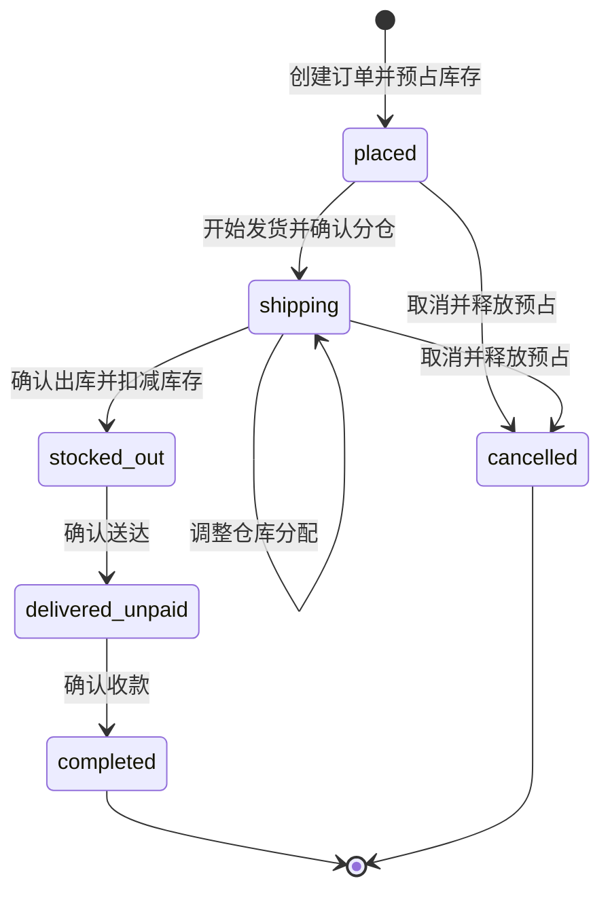

# 订单管理模块

## 概述

销售订单负责下单、库存预占、分仓发货、出库、送达和收款。创建订单时只选择客户、商品和数量，不选择仓库；系统自动跨仓预占库存，进入发货阶段后允许重新调整每个商品的仓库分配。

## 状态流转

| 状态 | 文案 | 可执行操作 |
|---|---|---|
| `placed` | 已下单 | 开始发货、取消 |
| `shipping` | 正在发货 | 调整分仓、确认出库、取消 |
| `stocked_out` | 已出库 | 确认送达 |
| `delivered_unpaid` | 已送达未付款 | 确认收款 |
| `completed` | 已完成 | 查看 |
| `cancelled` | 已取消 | 查看 |

出库后不允许取消销售订单；客户退回商品必须创建独立退货单。

## 库存规则

1. 创建订单时按启用仓库自动跨仓分配，执行 `locked += quantity`，实际库存 `quantity` 不变。
2. 开始发货或调整分仓时，先释放本订单旧预占，再按新分配重新锁定；同一商品允许多个仓库共同承担。
3. 确认出库时按当前 `reserved` 分配执行 `quantity -= quantity`、`locked -= quantity`，并按仓库生成 `order_deduction` 流水。
4. `placed` 或 `shipping` 取消时仅释放预占，不生成库存流水。
5. 所有库存行按商品、仓库固定顺序加锁，避免并发超卖和死锁。

## 审计字段

| 动作 | 字段 |
|---|---|
| 开始发货 | `shipping_started_at`, `shipping_started_by` |
| 确认出库 | `stock_out_at`, `stock_out_by` |
| 确认送达 | `delivered_at`, `delivered_by` |
| 确认收款 | `paid_at`, `paid_by` |
| 取消订单 | `cancelled_at`, `cancelled_by`, `cancel_reason` |

操作人均由后端使用当前登录用户写入，前端不提交审计用户名。每次状态变化同时写入 `order_status_logs`。

## 客户统计

只有 `delivered_unpaid -> completed` 时增加客户 `total_spent`、`order_count` 并更新 `last_order_at`。订单流程不自动调整客户等级，等级由人工维护。

## API

- `POST /api/v1/orders`
- `GET /api/v1/orders`
- `GET /api/v1/orders/{id}`
- `PUT /api/v1/orders/{id}/start-shipping`
- `PUT /api/v1/orders/{id}/shipping-allocations`
- `PUT /api/v1/orders/{id}/stock-out`
- `PUT /api/v1/orders/{id}/deliver`
- `PUT /api/v1/orders/{id}/complete`
- `PUT /api/v1/orders/{id}/cancel`

## 前端

订单列表位于 `/order/list`。新建订单使用 Modal 和公共 `ProductSelectModal`；列表工具栏与行内操作根据订单状态展示对应履约动作，详情 Drawer 展示库存分配、状态日志和各阶段操作人/时间。
