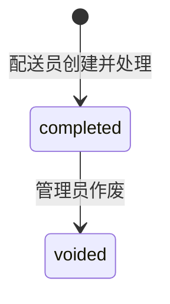

# 退货单模块

## 业务边界

退货由配送员从**本人当前配送中**的配送任务发起。该任务只用于确认办理人和客户；退货明细可以选择该客户任意历史 `stocked_out`、`delivered_unpaid` 或 `completed` 订单的商品明细。商品、条码和单价均由来源订单明细派生，前端不得自由填写。

客户等级当前仅人工维护；订单完成和退货只更新 `total_spent`，不自动升降级或写等级变更日志。

## 状态与金额

- 原订单 `total_amount` 永不修改。
- 创建退货时增加来源订单 `returned_amount`，`net_amount = total_amount - returned_amount`。
- 未收款订单仅降低净应收；来源订单已完成时，同时按实际冲减额降低客户 `total_spent`。
- 同一来源订单明细的所有已完成退货数量不能超过原销售数量；创建和作废都使用行锁。

## 创建与作废

创建在同一事务中锁定配送任务、客户、来源订单明细及退货数量，验证配送归属、客户一致性、状态、可退数量和入库仓库；随后写入退货单、库存流水、订单退货金额及客户消费审计。

仅管理员可作废。作废会扣回此前入库库存、回退来源订单 `returned_amount`，并恢复创建时实际扣减的客户累计消费；已作废退货单不可重复作废。

## API 与前端

- `GET /api/v1/deliveries/{delivery_id}/returnable-items`：配送员加载历史可退商品。
- `POST /api/v1/return-orders`：提交 `handling_delivery_id` 和每条 `source_order_item_id`、数量、原因、状况、入库信息。
- `GET /api/v1/return-orders`、`GET /api/v1/return-orders/{id}`：所有登录用户查看记录。
- `PUT /api/v1/return-orders/{id}/void`：仅管理员。

配送页面提供“现场退货”入口。`/order/returns` 仅保留退货记录查看和管理员作废，不能创建自由退货单。
