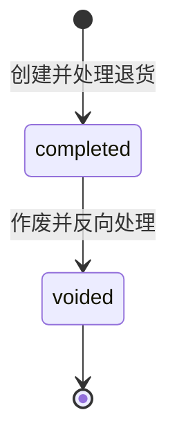

# 退货单模块

## 概述

退货单是独立业务单据，不要求关联原销售订单。适用于商品送达客户后现场退货：记录客户、商品、数量、退货单价、商品状况和退货原因，并由每条明细独立决定是否入库。

## 状态图

- `completed`：退货记录、可选入库和客户累计消费冲减已完成。
- `voided`：原入库和累计消费冲减已反向恢复。
- 已完成退货单不可编辑或删除，只能填写原因后作废。

## 创建事务

1. 锁定客户，校验商品和启用仓库。
2. 入库明细必须选择仓库；不入库明细不得保留仓库。
3. 对入库明细增加指定仓库库存，按仓库生成 `customer_return_in` 流水。
4. 退货金额按可编辑退货单价乘数量汇总。
5. 客户累计消费更新为 `max(0, total_spent - total_amount)`。
6. 保存 `customer_spent_before`、`customer_spent_after` 和实际冲减额 `spend_deduction_amount`。
7. 不减少客户 `order_count`，不调整客户等级，退货单直接进入 `completed`。

## 作废事务

1. 锁定退货单、客户和原入库仓库库存。
2. 原入库商品必须有足够未锁定库存可扣回，否则整单作废失败。
3. 按仓库生成 `customer_return_void_out` 流水。
4. 只恢复创建时实际冲减的 `spend_deduction_amount`，不恢复因累计消费触底而未扣除的金额。
5. 记录 `voided_by`、`voided_at`、`void_reason` 和作废前后累计消费审计值。

## 前端批量处理

页面位于 `/order/returns`。新建 Modal 使用公共 `ProductSelectModal`，支持勾选多条明细后批量：

- 设为入库并指定仓库；
- 设为不入库并清空仓库；
- 设置商品状况；
- 设置退货原因；
- 批量设置后继续逐条覆盖。

页面同时提供列表、详情 Drawer 和作废 Modal。

## API

- `POST /api/v1/return-orders`
- `GET /api/v1/return-orders`
- `GET /api/v1/return-orders/{id}`
- `PUT /api/v1/return-orders/{id}/void`
