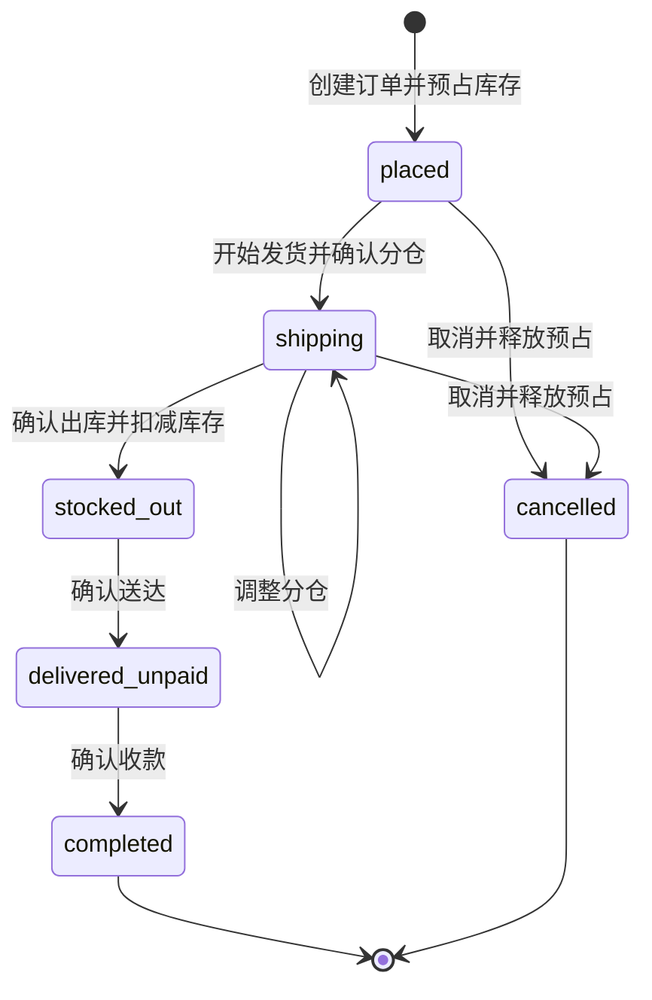
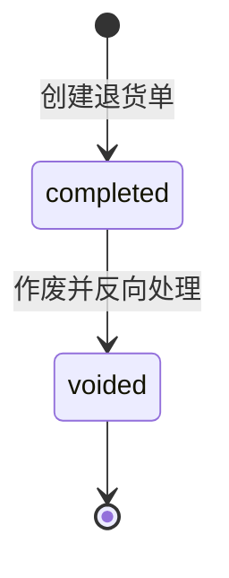

# 订单履约与独立退货单设计

## 目标

将销售订单从简单的“下单、发货、付款、完成”扩展为可审计的履约流程，并新增不依赖原销售订单的独立退货单。销售订单负责预占、分仓、出库、送达和收款；退货单负责现场退货记录、可选入库、客户累计消费冲减和作废反向处理。

## 领域规则

统一术语以根目录 `CONTEXT.md` 为准。

- 客户等级只允许人工调整，订单、退货单和定时任务均不自动升级或降级。
- 销售订单出库前可以取消；出库后的退回必须使用独立退货单。
- 退货单不要求关联原销售订单，也不校验原订单购买数量。
- 退货单创建后直接完成；录错时作废，不允许删除或编辑已完成单据。
- 退货商品按明细逐项决定是否入库，并支持批量设置后逐项覆盖。

## 销售订单状态

| 状态 | 文案 | 库存含义 |
|---|---|---|
| `placed` | 已下单 | 已跨仓预占，尚未开始履约 |
| `shipping` | 正在发货 | 正在拣货、打包、调整分仓，保持预占 |
| `stocked_out` | 已出库 | 已按最终分配扣减实际库存 |
| `delivered_unpaid` | 已送达未付款 | 客户已签收，尚未确认收款 |
| `completed` | 已完成 | 已送达并确认全额收款 |
| `cancelled` | 已取消 | 出库前取消并释放预占 |

## 销售订单操作

### 创建订单

沿用当前自动跨仓预占：默认仓库优先，其余仓库按可用库存分配；任一商品不足则整单回滚。

### 开始发货

`placed` 订单提交当前仓库分配后进入 `shipping`。后端原子释放旧预占并建立新预占，只修改 `locked`，不扣减 `quantity`。记录 `shipping_started_at` 和 `shipping_started_by`。

### 调整分仓

只有 `shipping` 允许调整分仓。每条订单明细的分配数量合计必须等于订购数量；同一商品可以分配到多个仓库。调整继续只操作预占。

### 确认出库

只有 `shipping` 可以确认出库。后端按当前预占分配扣减库存，释放锁定，按仓库生成 `order_deduction` 流水，并记录 `stock_out_at`、`stock_out_by`。当前 `shipped_at`、`shipped_by` 迁移为出库字段。

### 确认送达

只有 `stocked_out` 可以确认送达。记录 `delivered_at`、`delivered_by`，不修改库存。

### 确认收款

只有 `delivered_unpaid` 可以确认收款并进入 `completed`。记录 `paid_at`、`paid_by`，增加客户累计消费和订单数，但不调整客户等级。

### 取消订单

只有 `placed`、`shipping` 可以取消。释放所有 `reserved` 分配并记录 `cancelled_at`、`cancelled_by`、`cancel_reason`。出库后不允许取消。

## 独立退货单

### 状态

| 状态 | 文案 | 含义 |
|---|---|---|
| `completed` | 已完成 | 退货记录、库存和客户累计消费均已处理 |
| `voided` | 已作废 | 原处理已反向恢复 |

### ReturnOrder

- `return_no`：唯一退货单号。
- `customer_id`：必填客户。
- `total_amount`：退货明细金额合计。
- `status`：`completed` 或 `voided`。
- `operator`、`completed_at`、`remark`。
- `customer_spent_before`、`customer_spent_after`：创建时累计消费审计值。
- `spend_deduction_amount`：本次实际冲减累计消费金额，等于 `customer_spent_before - customer_spent_after`。
- `voided_by`、`voided_at`、`void_reason`。
- `void_customer_spent_before`、`void_customer_spent_after`：作废时累计消费审计值。

### ReturnOrderItem

- 商品快照：`product_id`、`product_name`、`barcode`。
- 金额：`quantity`、`unit_price`、`subtotal`。
- 业务信息：`condition`、`return_reason`、`remark`。
- 入库决策：`should_stock_in`、可空 `warehouse_id`。

商品状况枚举：`normal`、`expired`、`damaged`、`other`。

### 创建处理

商品默认使用当前标准售价，允许修改退货单价。退货总金额为所有明细小计之和。创建事务内：

1. 锁定客户并校验商品、仓库和明细。
2. 对 `should_stock_in=true` 的明细增加指定仓库库存。
3. 按仓库生成 `customer_return_in` 流水。
4. 将客户累计消费更新为 `max(0, total_spent - total_amount)`。
5. 不修改客户订单数和等级。
6. 退货单直接保存为 `completed`。

### 作废处理

只有 `completed` 可以作废，作废原因必填。事务内：

1. 锁定退货单、客户和涉及库存。
2. 对原入库明细从原仓库扣回数量；任一仓库不足则整次失败。
3. 按仓库生成 `customer_return_void_out` 流水。
4. 将 `spend_deduction_amount` 重新增加到客户当前累计消费；当创建时因累计消费触底为零而未能扣完退货总金额时，不恢复未实际扣减的部分。
5. 保存作废审计字段并改为 `voided`。

## 前端交互

### 订单列表

- `placed`：开始发货、取消。
- `shipping`：调整分仓、确认出库、取消。
- `stocked_out`：确认送达。
- `delivered_unpaid`：确认收款。
- `completed`、`cancelled`：只允许查看。
- 工具栏根据单选订单状态提供对应主操作，行内保留同等操作入口。

### 退货单页面

菜单位于“订单管理 / 退货单”，路由 `/order/returns`。页面包含列表、新建 Modal、详情 Drawer 和作废 Modal。

新建退货单使用公共 `ProductSelectModal`。退货明细表支持：

- 批量设为入库并指定仓库。
- 批量设为不入库并清空仓库。
- 批量设置商品状况和退货原因。
- 批量设置后逐条覆盖。

校验：入库明细必须选择仓库；不入库明细不得保留仓库；数量和单价必须有效；至少一条明细。

## 接口

销售订单：

- `PUT /api/v1/orders/{id}/start-shipping`
- `PUT /api/v1/orders/{id}/shipping-allocations`
- `PUT /api/v1/orders/{id}/stock-out`
- `PUT /api/v1/orders/{id}/deliver`
- `PUT /api/v1/orders/{id}/complete`
- `PUT /api/v1/orders/{id}/cancel`

退货单：

- `POST /api/v1/return-orders`
- `GET /api/v1/return-orders`
- `GET /api/v1/return-orders/{id}`
- `PUT /api/v1/return-orders/{id}/void`

所有写接口使用当前登录用户作为操作人，前端不得提交审计用户名。

## 数据迁移

新增单个增量 SQL，完成：

- 重建三个订单状态枚举并迁移历史状态；`shipped` 映射 `stocked_out`，`paid` 映射 `completed`。
- 对历史 `paid` 订单补齐完成订单应增加的客户累计消费和订单数，历史 `completed` 订单不重复累计。
- `shipped_at`、`shipped_by` 重命名为 `stock_out_at`、`stock_out_by`。
- 增加开始发货、送达、收款、取消的审计字段。
- 新增退货单、退货明细、枚举、索引和约束。
- 为库存流水类型增加 `customer_return_in`、`customer_return_void_out`。

开发库当前没有销售订单数据，但迁移仍包含历史映射并必须通过 DBX 执行验证。

## 非本阶段范围

- 关联原销售订单。
- 部分付款、付款流水、退款流水或应收账款。
- 部分送达、多张发货单或物流轨迹。
- 自动客户等级调整。
- 已完成退货单编辑或物理删除。
